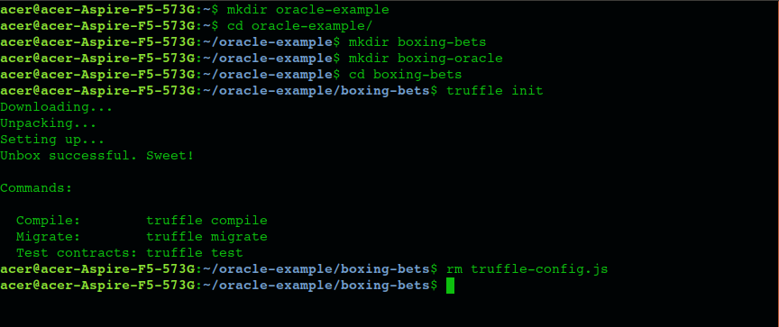
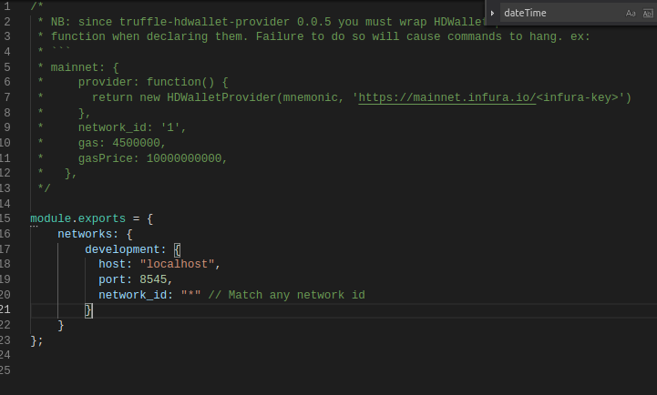
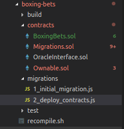
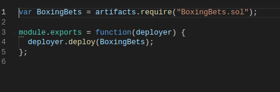
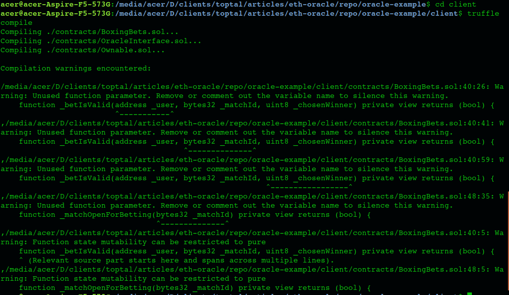
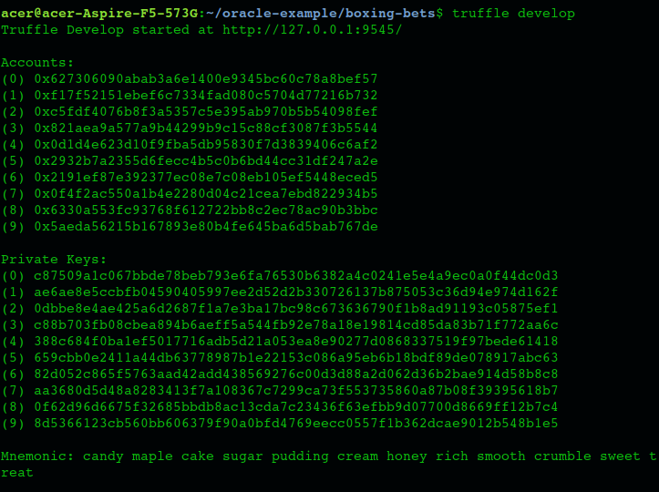
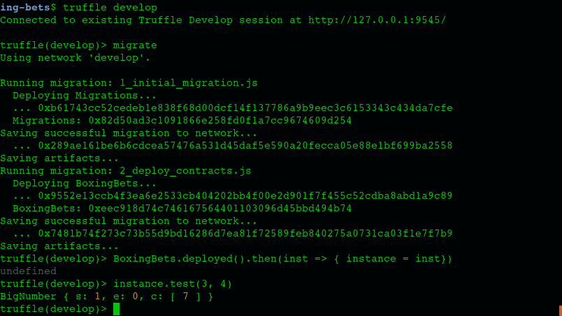

# ETH Smart Contract Oracles Part 1: Setup and Orientation 

## Intro 

Ethereum Smart Contracts. More than just "the new hot thing", it's my belief that they (or something related) are poised to change the way that humans do business with one another in the upcoming new age of the internet. Time will tell if that's the case. 

This is the first of a three part article on eth smart contract development with Solidity, most specifically exploring the contentious issue of the use of contracts with so-called "oracles" - which are basically contracts which pump data into the blockchain for use by other contracts. 

The goal of this, part 1 of the series, is not to get into oracles, the philosophy behind them, or even very deeply into what they are; the goal of this part is simply to: 
- get you set up with building smart contracts with truffle 
- build a smart contract project which will serve us in parts 2 and 3
- introduce a few concepts related to ethereum smart contracts and coding of smart contracts 
- introduce the compile/run/debug cycle with truffle and smart contracts 


### Software Requirements 
- any major OS will work, though some of the installation & setup will of course be different. I have done all of this on ubuntu Linux (16.04). I have also had no problems setting up the environment on windows. I have not tried Mac, though I am aware that it's common to do so on Mac as well. 
- it is not necessary to run a full eth node; we will use truffle which comes with its own testnet. If you know a bit about what you're doing you can use any other testnet of your choosing; truffle's local dev testnet is just the easiest & most accessible for purposes of this tutorial. 

### Knowledge Requirements 
- basic knowledge of how blockchain works 
- understanding of what a blockchain-based smart contract is 
- some basic hello-worldish experience with smart contract development will be helpful, but not necessary if you're smart & ambitious (and I know that you are) 

This article series *can* serve as a very first introduction to smart contracts, but it ramps up very quickly into more advanced concepts. If it's your first eth smart contract tutorial, be prepared to climb to altitude quickly. If you feel confident, great; if not, feel free to get a simpler 'hello world' type of tutorial or two under your belt first. Here are a few, for example: 

- https://cryptozombies.io/
- https://codeburst.io/build-your-first-ethereum-smart-contract-with-solidity-tutorial-94171d6b1c4b

A caveat: the smart contract space, being so new, changes quickly. Solidity syntax features that were new when this article was written may be deprecated or obsoleted by the time you're reading this. Geth versions may have come & go. So, be prepared if necessary to adapt the information in this article to the new landscape of the future; if you're serious about learning smart contract development, then I have faith in you. 


### Description of Example App

Use case: betting on boxing matches. Users can choose a boxing match, and make a bet on the winner (for simplicity's sake, you just pick the winner, nothing more fancy than that). When the winner is declared, the house (contract owner) takes a predetermined and transparent cut, the losers lose their stake, and the winners split the pot. The amount of the winners' take is determined by the size of their bet. 

#### Brief Introduction: What is an Oracle?

Smart contracts are a new thing, they've yet to take the mainstream, and so many aspects of how they will work have not yet been hammered out and standardized. I will briefly explain the impetus behind the idea of the "oracle", and - be patient - we'll get into it in more depth in later parts. 

Programming blockchain contracts is not like programming a client-server app. All data with which the contract interacts, must already be on the blockchain. There is no calling *out* of the blockchain. Not only is it not supported by the language, it's not supported by the blockchain paradigm. The contract can take bets in the form of ethereum currency, store them in the contract, and release them to the correct wallet addresses according to a formula, when the winner of a match is declared. But how does the contract know the winner? It can't query a REST API or anything like that. It can only use data that's already in the blockchain! Many many use cases of smart contracts run into a similar problem - they are seriously limited unless they can interact with the world outside the blockchain. 

If the contract can only interact with data on the blockchain, an obvious solution is to inject the necessary data into the blockchain. And that's what an oracle is. An oracle is another contract, which injects data into the blockchain, allowing other contracts to consume it. While that may raise questions about trust and trustlessness, just accept for now that that's what an oracle is. In our example use case, the oracle will be the contract that injects data about boxing matches into the blockchain, and the winners of those matches. 

## Setup 

For basic setup, we will install: 
- geth (optional for now)
- truffle 
- ganache-cli (optional)
- a development environment (optional) 

This article does not have the space to be a full guide to setup of the environment, but acts as just a rough guide; but that's ok because there are already plenty of more complete setup guides for your particular OS, and the internet doesn't really need a new one. So I will take you quickly down the path, and point you towards some resources for getting more details as needed. Be prepared to install requirements and prereqs, as your system requires and as google directs you. 

### Install geth (optional) 
Geth is go-ethereum, the ethereum core software; while it's not necessary for this exercise at all, it would behoove any would-be ethereum developer to have it & be familiar with it. It will be necessary if you're ever going to deploy your smart contract to the live ethereum network. 
- http://www.talkcrypto.org/blog/2018/01/23/what-is-geth/
- https://github.com/ethereum/go-ethereum/wiki/Installation-Instructions-for-Ubuntu
- https://github.com/ethereum/go-ethereum/wiki/Installation-instructions-for-Windows

### Install truffle 
Truffle is the main thing we're going to use for development, and absolutely is a requirement for this guide. Find & follow the specific instructions for your OS to install truffle. Below are some links that will hopefully help you. 
- https://truffleframework.com/docs/truffle/getting-started/installation
- https://github.com/trufflesuite/truffle
- https://truffleframework.com/tutorials/how-to-install-truffle-and-testrpc-on-windows-for-blockchain-development

### Install ganache-cli (optional) 
I recommend installing ganache-cli to use as another testing tool, though we won't actually use it for our tutorial. It's optional. 
- https://github.com/trufflesuite/ganache-cli

### Development Environment 
It would be more than possible to do this whole tutorial with any simple text editor, like Notepad++, gedit, vi, or any text editor or IDE of your choosing. I personally am using Visual Studio Code with the following extensions: 
- solidity
- solidity extended 
- material icon theme 

(the extensions are not required, they just make for a better coding environment) 


## Running the Code 

### Project Setup 
Some project setup will be necessary in order to integrate with truffle. Now we'll set up the shell for our project, both in truffle and in the directory structure. Just sit back, follow the steps robotically, and enjoy.  

- create a directory to house all the code; call it oracle-example 
- inside of the root directory, create two subdirectories, because eventually the project will consist of two sub-projects. Create the directories: 
	*/oracle-example/client*
	*/oracle-example/oracle*
- go into the client folder, because that's the first project we're going to develop. Open a terminal (command line) window in the */oracle-example/client* folder 
- run the command "truffle init" 
- note that among many files created are "truffle-config.js" and "truffle.js". We don't need both of them, so delete truffle-config.js (just to avoid confusion and clutter) 



- we need to edit truffle.js, in order to point truffle in the right direction for testing. Replace the contents of truffle.js with the following: 
```
	module.exports = {
		networks: {
			development: {
				host: "localhost",
				port: 8545,
				network_id: "*" // Match any network id
			}
		}
	};
```
https://github.com/jrkosinski/oracle-example/tree/part1-step1/client/truffle.js



- note that truffle init created a directory called "migrations". Inside of that folder should be a file named "1_initial_migration.js". 
- add another file in the migrations directory; name it "2_deploy_contracts.js", with the following content: 
```
	var BoxingBets = artifacts.require("BoxingBets");

	module.exports = function(deployer) {
		deployer.deploy(BoxingBets);
	};
```
https://github.com/jrkosinski/oracle-example/tree/part1-step1/client/migrations/2_deploy_contracts.js





### Adding the Code 

Now that the simple setup is out of the way, we're set to begin coding. Remember, that this part of the article is still introduction & setup, so we're going to go rather quickly through the code. We'll get into more in-depth explanations of the code in part 2, and more in-depth discussion of the architecture & philosophy in part 3. That said, we'll touch quickly upon some core concepts evident in the code. 

The full code for this step in the process is available on github: 
https://github.com/jrkosinski/oracle-example/tree/part1-step1

#### Contracts 
A 'contract' in Solidity is roughly analagous to a class in other object-oriented languages. The language itself has been compared to Golang and Javascript, among others. Some other language constructs in Solidity - which we'll have examples of later - are modifiers, libraries, and interfaces. Inheritance (including multiple inheritance) is supported for contracts. Solidity contract files have a .sol extension. 

#### Oracle 	Interface
add this file to your project: 

/oracle-example/client/contracts/OracleInterface.sol 

https://github.com/jrkosinski/oracle-example/tree/part1-step1/client/contracts/OracleInterface.sol

Normally, the oracle interface would be just that - an interface. For this very first iteration, it's just a simple class contained within the Solidity project, just as a placeholder for now. We'll move it out in the very next step, after we successfully compile & run the contract on truffle. When we convert this to an actual interface, the function implementations will be empty. 
	
#### Client Contract
add this file to your project: 

/oracle-example/client/contracts/BoxingBets.sol

https://github.com/jrkosinski/oracle-example/tree/part1-step1/client/contracts/BoxingBets.sol
 
This is the contract which consumes the boxing data, allows users to query available matches, and place bets on them. In later iterations, it will calculate and pay out winnings. 


### Compiling and Running 

Now is when we will see if we got everything right the first time! 

#### Compile and Migrate the Contract 
- open a terminal in the /oracle-example/client/ folder 
- compile the code with this command: 
```
truffle compile
```
Alt: use my recompile.sh shell script (https://github.com/jrkosinski/oracle-example/tree/part1-step1/client/recompile.sh) 

Note that you will see alot of warnings, because our code is not yet in its final form. 



- open the truffle development console: 
```
truffle develop
```



- migrate to the test network 
```
migrate
```

#### Run the Contract 
- at the development console prompt, enter the following line of code: 
```
BoxingBets.deployed().then(inst => { instance = inst })
```
now, "instance" is the variable which refers to the BoxingBets contract, and can be used to call its public methods. 
- test it using the following command: 
```
instance.test(3, 4) 
```
Note that we've included a public "test" function in BoxingBets.sol. It adds together whatever 2 numbers you pass to it, just to demonstrate that the contract is executing code, and that we can call it from the truffle develop console. If we get a sane-looking response (see below) then our job here is done! (for now) 



## Separate the Oracle 

If everything has succeeded so far, then we're over the hump. The next thing we'll do is separate the oracle contract from the BoxingBets contract. In real usage, the oracle's contract will exist separately from the client contract on the blockchain, so we'll need to be able to: 
- instantiate it by blockchain address 
- dynamically change the oracle address that the client contract uses to reference the oracle 

### client
First, we're going to change the client contract (client) so that it refers to a dynamic interface to an oracle rather than a concrete class. Then we'll make sure that it instantiates the oracle from an outside contract. 

Go into /oracle-example/client/contracts/OracleInterface.sol. As we noted before, this is currently not an interface, but we're about to make it one. Replace what's in there with the contents of: 

https://github.com/jrkosinski/oracle-example/tree/part1-step2/client/contracts/OracleInterface.sol

```
pragma solidity ^0.4.17;

contract OracleInterface {

    enum MatchOutcome {
        Pending,    //match has not been fought to decision
        Underway,   //match has started & is underway
        Draw,       //anything other than a clear winner (e.g. cancelled)
        Decided     //index of participant who is the winner 
    }

    function getPendingMatches() public view returns (bytes32[]);

    function getAllMatches() public view returns (bytes32[]);

    function matchExists(bytes32 _matchId) public view returns (bool); 

    function getMatch(bytes32 _matchId) public view returns (
        bytes32 id,
        string name, 
        string participants,
        uint8 participantCount,
        uint date, 
        MatchOutcome outcome, 
        int8 winner);

    function getMostRecentMatch(bool _pending) public view returns (
        bytes32 id,
        string name, 
        string participants,
        uint participantCount,
        uint date, 
        MatchOutcome outcome, 
        int8 winner);

    function testConnection() public pure returns (bool);

    function addTestData() public; 
}
```

In BoxingBets.sol, we're going to replace this line: 
```
    OracleInterface internal boxingOracle = new OracleInterface(); 
```

with these two lines: 
```
    address internal boxingOracleAddr = 0;
    OracleInterface internal boxingOracle = OracleInterface(boxingOracleAddr); 
```

Now what we want is a way to set the address of the oracle, dynamically, and a function that we can call to find out the current oracle address. Add these two functions to BoxingBets.sol: 

```
    /// @notice sets the address of the boxing oracle contract to use 
    /// @dev setting a wrong address may result in false return value, or error 
    /// @param _oracleAddress the address of the boxing oracle 
    /// @return true if connection to the new oracle address was successful
    function setOracleAddress(address _oracleAddress) external onlyOwner returns (bool) {
        boxingOracleAddr = _oracleAddress;
        boxingOracle = OracleInterface(boxingOracleAddr); 
        return boxingOracle.testConnection();
    }

    /// @notice gets the address of the boxing oracle being used 
    /// @return the address of the currently set oracle 
    function getOracleAddress() external view returns (address) {
        return boxingOracleAddr;
    }
```

### oracle

#### Setup 

Now that the BoxingBets contract is attempting to refer to a completely separate contract (that is the oracle), our next job is to create that oracle contract. So we're going to now create a whole separate project that will contain the oracle contract. It's essentially the same setup that we've already done for the client contract project; that is, setting up truffle for compiling & developing. 

- you should already have a folder called /oracle-example/oracle/. Open a terminal in that directory. 
- run the command "truffle init" 


- delete /oracle-example/oracle/truffle-config.js. 
- edit /oracle-example/oracle/truffle.js like so: 

```
	module.exports = {
		networks: {
			development: {
				host: "localhost",
				port: 8545,
				network_id: "*" // Match any network id
			}
		}
	};
```
https://github.com/jrkosinski/oracle-example/tree/part1-step2/oracle/truffle.js


- inside of /oracle-example/oracle/migrations/, create a file called "2_deploy_contracts.js", with the following content: 
```
	var BoxingOracle = artifacts.require("BoxingOracle");

	module.exports = function(deployer) {
		deployer.deploy(BoxingOracle);
	};
```
https://github.com/jrkosinski/oracle-example/tree/part1-step2/oracle/migrations/2_deploy_contracts.js


#### Oracle Code 
For this step, simply copy the following three files from https://github.com/jrkosinski/oracle-example/tree/part1-step2/oracle/contracts/ into your /oracle-example/oracle/contracts/ folder: 
- BoxingOracle.sol: the main oracle contract 
- Ownable.sol: for owner-only functions, as we used in the client contract already 
- DateLib.sol: a date library; we'll look at in more depth, in Part 2 of this series 

### Testing the Oracle 
Now, in the project's current iteration, we really need to thoroughly test the oracle, since that will be our base on which we'll build the rest of the project. So, now that we've set up the oracle project and copied the code, we will want to: 
- compile the oracle 
- make sure that the oracle runs 
- run a few functions in the truffle console to ensure that the oracle is working as expected 

#### Compile and Migrate the Oracle 
Still in a terminal open to /oracle-example/oracle/, run the following commands. Again, these steps are identical to what we've already done to compile & migrate the client contract.  
```
truffle compile
```
Alternate: use my recompile.sh shell script (https://github.com/jrkosinski/oracle-example/tree/part1-step2/oracle/recompile.sh) 

- open the truffle development console: 
```
truffle develop
```
- migrate to the test network 
```
migrate
```
<screenshot?> 

#### Run & Test the Oracle 
Still in the truffle development console, enter this to capture a usable pointer to the oracle contract: 
```
BoxingOracle.deployed().then(inst => { instance = inst })
```

Now we can (and should) run a suite of tests on our oracle contract to test it. Try running the following commands, each in turn, and examine the results. 

```
instance.testConnection()
instance.getAllMatches()
instance.addTestData()
instance.getAllMatches()
```
TODO: add more tests 


## Testing and Debugging 
Now we're ready for the final test: to test that the client contract can call the oracle contract that's already on the blockchain, and pull in and use its data. If all of this works, then we have a client-oracle pair that we can use for further experimentation. Our steps to run the end-to-end test: 
- compile and run the oracle contract
- compile and run the client contract 
- get the address of the oracle contract 
- set the oracle address in the client contract 
- add test data to the oracle contract 
- test that we can retrieve that data in the client contract 

Open two terminal windows: one in /oracle-example/client/ and the other in /oracle-example/oracle/ 

### Compile and Run the Oracle Contract 
```
>bash recompile.sh
>truffle develop 
>migrate 
>BoxingOracle.deployed().then(inst => { instance = inst })
```

### Compile and Run the Client Contract
```
>bash recompile.sh
>truffle develop 
>migrate 
>BoxingBets.deployed().then(inst => { instance = inst })
```

### Get the Address of the Oracle Contract 

### Set the Oracle Address in the Client Contract 

### Add Test Data to the Oracle Contract 

### Test that we can Retrieve that Data in the Client Contract 

## Conclusion 
